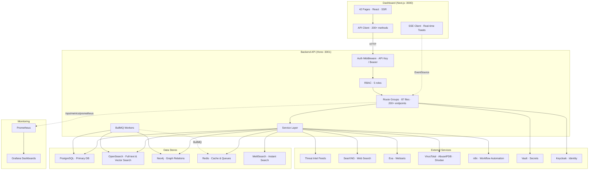
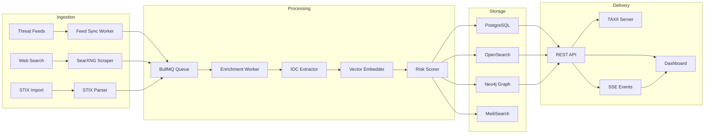
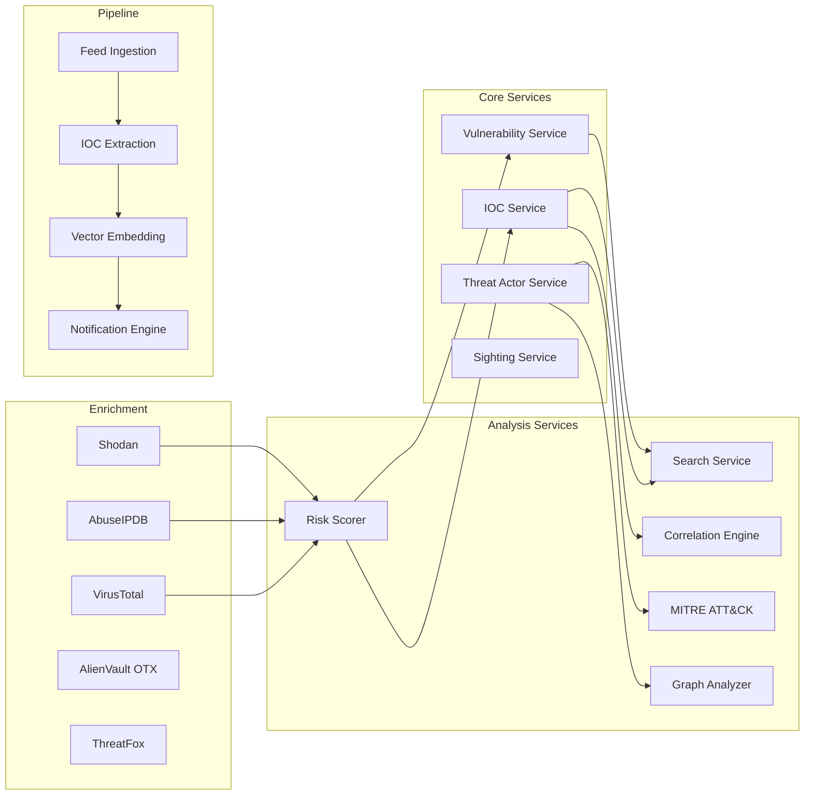
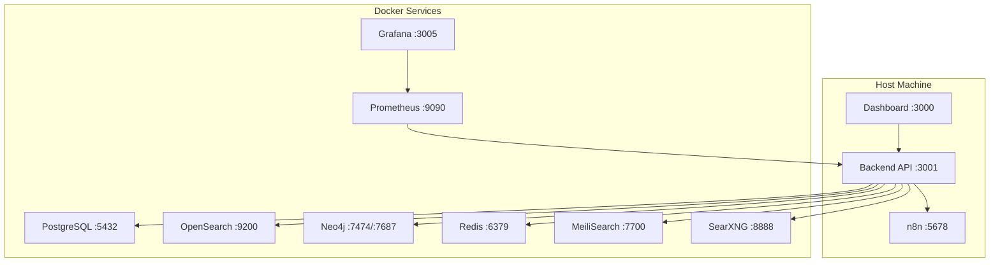

# Rinjani CTI Platform — Architecture

## System Overview

## Data Flow

## Tech Stack

| Layer | Technology | Purpose |
|-------|-----------|---------|
| **Runtime** | Node.js 20 + TypeScript 5 | Server runtime |
| **Web Framework** | Hono | HTTP routing, middleware |
| **Frontend** | Next.js 14 + React | Dashboard SSR/SSG |
| **Primary DB** | PostgreSQL (Drizzle ORM) | Structured data, relations |
| **Search** | OpenSearch | Full-text + 384-dim vector search |
| **Graph** | Neo4j | Entity relationships, attack paths |
| **Cache/Queues** | Redis + BullMQ | Caching, job queues, rate limiting |
| **Instant Search** | MeiliSearch | Typo-tolerant instant search |
| **Auth** | API Keys + Keycloak + Vault | Authentication & secrets |
| **Monitoring** | Prometheus + Grafana | Metrics & dashboards |
| **Automation** | n8n | Workflow orchestration |
| **ML/AI** | @xenova/transformers | Vector embeddings (384-dim) |

## Service Architecture

## Database Schema Overview

| Table | Purpose | Key Fields |
|-------|---------|-----------|
| `iocs` | Indicators of Compromise | value, type, severity, risk_score, first/last_seen |
| `vulnerabilities` | CVE records | cve_id, cvss_score, severity, description |
| `threat_actors` | Named threat groups | name, aliases, motivation, sophistication |
| `sightings` | IOC observation records | ioc_id, source, confidence, observed_at |
| `web_intel_items` | Scraped web content | url, title, text_content, source |
| `web_intel_mentions` | IOC mentions in web content | item_id, ioc_value, ioc_type, context |
| `alert_rules` | User-defined alert rules | name, conditions, severity, enabled |
| `audit_log` | System activity audit | user_id, action, entity, timestamp |
| `playbooks` | SOAR playbook definitions | name, steps, trigger, last_run |
| `warninglists` | False-positive exclusion lists | name, type, entries |
| `yara_rules` | YARA detection rules | name, rule_content, enabled |
| `users` | Platform users | email, role, api_token, active |

## Deployment

> See [DEPLOY.md](./DEPLOY.md) for full deployment instructions and [docs/API.md](./docs/API.md) for endpoint reference.
