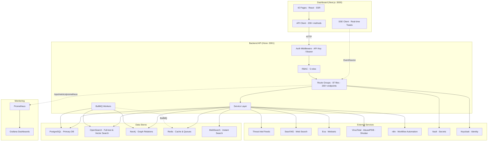
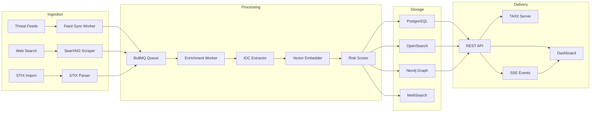
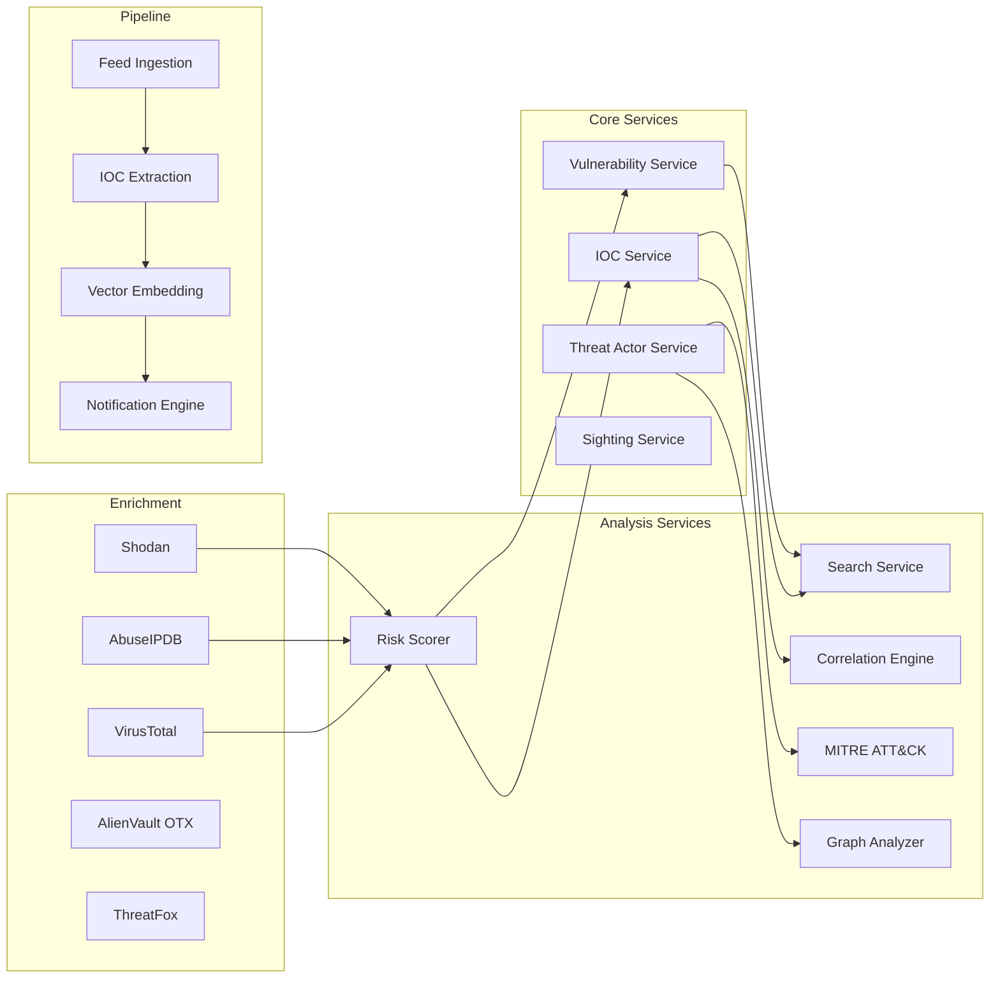
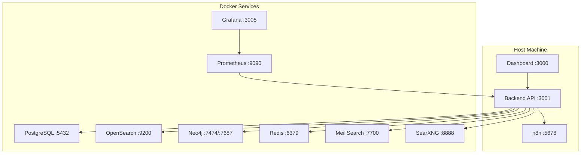

# Rinjani CTI Platform — Architecture

## System Overview



## Data Flow



## Tech Stack

| Layer | Technology | Purpose |
|-------|-----------|---------|
| **Runtime** | Node.js 20 + TypeScript 5 | Server runtime |
| **Web Framework** | Hono | HTTP routing, middleware |
| **Frontend** | Next.js 14 + React | Dashboard SSR/SSG |
| **Primary DB** | PostgreSQL (Drizzle ORM) | Structured data, relations |
| **Search** | OpenSearch | Full-text + 384-dim vector search |
| **Graph** | Neo4j | Entity relationships, attack paths |
| **Cache/Queues** | Redis + BullMQ | Caching, job queues, rate limiting |
| **Instant Search** | MeiliSearch | Typo-tolerant instant search |
| **Auth** | API Keys + Keycloak + Vault | Authentication & secrets |
| **Monitoring** | Prometheus + Grafana | Metrics & dashboards |
| **Automation** | n8n | Workflow orchestration |
| **ML/AI** | @xenova/transformers | Vector embeddings (384-dim) |

## Service Architecture



## Routing Conventions

The API surface is organized in three tiers under `apps/api/src/routes/`. Use
the table below when adding a new endpoint — there is exactly one right place
for each route.

| Endpoint shape | File location | Mount it via |
|----------------|---------------|--------------|
| `/v1/<feature>/*` — versioned public API | `routes/v1/<feature>.ts` | Append `v1.route('/', <feature>Routes)` in `routes/v1.ts` |
| `/admin/<feature>/*` — admin-only management | `routes/admin/<feature>.ts` | Append `adminRouter.route('/', <feature>Routes)` in `routes/admin.ts` |
| `/v2/<feature>/*` — next-major preview | `routes/v2/<feature>.ts` | Append in `routes/v2.ts` |
| `/<top-level>` — non-versioned (health, auth, graphql) | `routes/<feature>.ts` | Mount directly in `src/index.ts` (rare — prefer `/v1`) |

Each route file should export a default `Hono` instance and is mounted via
its aggregator. Path-prefix lives in the aggregator's `.route()` call, never
inside the route file's handlers. Example:

```ts
// routes/admin/<feature>.ts
import { Hono } from 'hono';
import { requireAuth, requireRole } from '../../middleware/auth';

const router = new Hono();

router.get('/<feature>', requireAuth, requireRole('admin'), async (c) => {
    // …
});

export default router;
```

```ts
// routes/admin.ts
import featureRoutes from './admin/<feature>';
adminRouter.route('/', featureRoutes);  // path lives in the GET above
```

### Permission gating

- `/v1/*` — most public endpoints require auth (use `requireAuth` middleware).
  A small set are intentionally unauthenticated (health, oauth callbacks).
- `/admin/*` — every handler must use `requireAuth` **and** `requireRole(...)`.
  Default to `requireRole('admin')`; relax only with deliberate intent (e.g.
  `requireRole('admin', 'auditor')` for read-only audit views).

### Where things should NOT live

- **Not in a `modules/` or `shared/` directory.** These were earlier
  restructuring attempts; both are now gone. Adding new top-level structural
  directories should be a deliberate architectural decision, not an ad-hoc
  reorganisation.
- **Not in two places at once.** Three duplicates of `stats.ts` previously
  carried the same bug. One source of truth per endpoint.
- **Not as a flat top-level file** unless the endpoint genuinely belongs
  outside `/v1` / `/admin` / `/v2`. When in doubt, it belongs under `/v1`.

## Tech Stack — What Stays, What Goes

Audit conducted as part of the ops-cleanup arc. Each component evaluated
on: number of importers, runtime use, whether it provides capability the
rest of the stack lacks.

### Keep — core CTI primitives

- **PostgreSQL** (via Drizzle ORM) — primary durable store. Schemas
  versioned via migrations in `packages/db/drizzle/`.
- **Redis (queue, port 6380)** — backs BullMQ. Persistence enabled.
- **Redis (cache, port 6381)** — rate limiting, dedup, ephemeral state.
- **OpenSearch** — full-text + vector search (`knn_vector` HNSW, 384-dim
  cosine). Covers everything an instant-search engine would; aggregations
  power the activity dashboard's throughput counters.
- **Neo4j** — actor/IOC relationship traversal and MITRE ATT&CK graph.
  Genuinely needed — relational SQL can't express "all actors using
  technique T that have hit organisations in industry I".
- **BullMQ** — task queue + scheduling. Mature, mainstream, appropriate
  for these workloads. (We deliberately rejected migrating to Temporal —
  see the ops-cleanup conversation: Temporal's strengths are wasted on
  workloads this stateless.)
- **Hono** — HTTP framework. Fast, modern, fine.
- **Gemini / OpenRouter** — LLM enrichment. OpenRouter is the failover.

### Remove — dead weight identified by audit

- **MeiliSearch** — only referenced by `startup.ts` health-check, an
  unused `/v1/meili/*` route group, and a config bootstrap entry. **Zero
  dashboard usage.** OpenSearch already provides typo-tolerant search via
  `match` with `fuzziness: "AUTO"`. Removing it cuts: one docker-compose
  service, `services/meilisearch.ts`, `routes/v1/meili.ts`, an admin
  config entry, and a healthcheck. Net: simpler stack, no capability lost.
- **n8n** — only referenced by `startup.ts` health-check + a config slot
  promising "if you set N8N_URL, we'll ping it". No actual SOAR workflows
  are wired through n8n; the **Playbooks** subsystem already covers our
  automation needs natively. Removing it cuts: the config slot, the
  startup probe, an empty Playbooks-vs-n8n decision point for operators.

### Worth keeping but documented for awareness

- **TAXII** (`routes/taxii.ts` + stream consumer) — STIX/TAXII protocol
  surface for external CTI consumers. No internal use, but valid as a
  *public-facing protocol endpoint* if external partners are intended
  consumers. Keep unless deliberately discontinuing TAXII support.
- **GraphQL** (`/graphql` via Yoga) — alternative query API. Adds surface
  area; useful if any consumer prefers GraphQL over REST. Keep unless we
  have evidence no one uses it.

### Recommended tech stack (canonical reference)

A self-hosted operational CTI platform at this scale runs comfortably on:

```
Hono · Drizzle · BullMQ · Redis × 2 · PostgreSQL · OpenSearch · Neo4j
                  │
                  └─ arctic (OAuth) · Gemini (LLM) · Yoga (GraphQL)
```

That's the **whole** core stack. Anything outside that list should pass a
"what does this give us we can't get from the core?" test before it
ships. The previous tendency to add a service for every conceivable
capability is exactly what produced the dead weight above.

### Pipeline visualization

`/admin/pipeline` renders the ingestion DAG as a read-only horizontal
flow: **Ingest → Enrich → Index → Graph → Notify**. Each stage aggregates
one or more BullMQ queues and shows live status (idle / running / healthy
/ degraded / erroring), throughput counters, and last-activity time.
Refreshes every 5s from `/admin/activity/throughput`.

The page is intentionally **read-only**. To act on a stage, click it —
each card links to the relevant queue inspector. Composition of new
stages is deliberately *not* available: see "What we are not building"
below.

### Follow-up admin slices (designed, not yet built)

These three pages are concretely designed but deferred — each is 2-4
hours focused work and best built as a separate slice rather than mashed
into one session.

**Services CRUD** (`/admin/services/configure` — separate from the
existing `/admin/services` health view).
- Reads/writes the `services_config` and `enrichment_providers` tables
  that already exist in the schema.
- Listed services: LLM providers (Gemini, OpenRouter), enrichment APIs
  (VirusTotal, AbuseIPDB, Shodan), TAXII external publishers.
- Per-service: edit credentials (masked), toggle on/off, "Test
  connection" button that calls a backend probe endpoint.
- Backend already has `routes/v1/enrichment-providers.ts` — extend with
  `POST` (create) and `DELETE` (remove) endpoints. Wrap in
  `requireRole('admin')`.
- Audit-log every write (entityType=`config`, action=`update` with
  metadata={field, oldMasked, newMasked}).

**Feeds Management** (`/admin/feeds`).
- List the 10 hardcoded feeds from the worker registry with their
  status (last sync, items/run, error rate from `feed_sync_runs`).
- Per-feed: enable/disable (write to `scheduled_job_overrides` we
  already have), edit auth-key (writes to `feeds_config`), change
  interval preset.
- New API keys typed into the form go through a "test sync" pass
  (one-shot run + capture failure) before being accepted.
- Sparkline per feed showing last 24h success/failure pattern —
  read from `feed_sync_runs` table.

### What we are not building

- **Visual DAG composer.** "Add a new feed source" via UI requires
  per-source parsing code. Drag-and-drop pipeline composition ends up as
  either a half-built no-code platform or a code-generator-from-UI
  (the Zapier/n8n problem). The current pattern — code defines the
  registry, admins toggle/configure — is the right pattern for a
  security-sensitive tool.
- **Runtime job/task registry.** Same reasoning. `JOB_REGISTRY` in
  `apps/api/src/queues/scheduler.ts` is the source of truth; the
  schedules page lets admins control schedules, not define new ones.
- **A second message-bus / orchestrator.** BullMQ is enough. We do not
  need Temporal, Kafka, or pg-boss for these workloads. (See the
  ops-cleanup discussion for the long-form argument.)

## Work-Driven Enrichment

Enrichment is **NOTIFY-driven**, not cron-driven. When data lands in
Postgres that needs enrichment, a trigger fires `pg_notify('rinjani_work', kind)`
and a listener in `apps/api/src/services/workListener.ts` translates the
notification into a BullMQ job. The pattern collapses "data arrived → got
enriched" latency from up-to-24h (old daily cron) down to seconds.

### Currently work-driven

| Entity | Trigger condition | Worker model | Backstop |
|--------|------------------|--------------|----------|
| **CVE / vulnerability** | `cvss_score IS NULL` on insert/update | Batch (worker drains backlog) | Boot sweep + admin "CVSS enrichment sweep" |
| **IOC** | `enriched_at IS NULL` on insert/update | Per-row (one job per IOC, capped 100/window) | Boot sweep + admin "IOC enrichment sweep" |

### Still on the old path

- **Threat actors** — there is no actor enrichment **worker** today;
  `services/actorEnrichment.ts` runs synchronously from the
  `/v1/threats/:id/enrich` endpoint. Migrating to work-driven needs a new
  BullMQ worker (`actor-enrichment` queue) before the NOTIFY pattern
  applies. Until then, actor enrichment fires only on explicit user
  action via the dashboard or admin "Bulk actor LLM enrichment".

### Dedup contract

Every NOTIFY routes through a Redis `SET NX EX` on key
`work-dedup:<kind>` with a 30-second TTL. A bulk feed sync that inserts
1000 IOCs in a minute produces 1000 NOTIFYs but only **one** dispatch
per kind per window — protects external enrichment APIs from stampede.

### Adding a new work-driven entity (template)

1. **Trigger**: drop a migration `0NNN_work_driven_<entity>.sql` that
   binds `notify_enrichment_work('<kind>-enrich')` to the table's INSERT
   / UPDATE with a `WHEN` clause matching "needs enrichment".
2. **Dispatch**: extend `workListener.ts` `switch (kind)` — either
   enqueue a single backlog-drain job (if worker is batch) or call a
   `sweep<Entity>Backlog()` function (if worker is per-row).
3. **Backstop**: add to `worker-entry.ts` boot path:
   `await triggerEnrichmentSweep('<kind>-enrich')`.
4. **Admin sweep button**: add a `/admin/jobs/<entity>-enrich-sweep`
   endpoint that calls `triggerEnrichmentSweep(...)` + a card on the
   `/admin/jobs` page.

## Response Envelope Contract

Every JSON endpoint emits exactly one of two shapes. The client unwraps
the envelope once; route handlers return `data` directly.

### Success

```jsonc
{
  "success": true,
  "data": <T>            // the actual payload
}
```

Route handlers use `c.json({ success: true, data: <T> })`. List endpoints
nest a `Pagination` inside `data` via the canonical helper (see
[DTO layer](../apps/api/src/dto/)):

```jsonc
{
  "success": true,
  "data": {
    "items": [...],
    "pagination": { "page": 1, "pageSize": 50, "total": 1234, "pages": 25 }
  }
}
```

### Error

```jsonc
{
  "success": false,
  "error": {
    "code": "VALIDATION_ERROR",    // machine-readable; matches AppError subclasses
    "message": "Invalid request data",
    "statusCode": 400,
    "details": [...]               // optional — Zod issues, conflict context, etc.
  }
}
```

The HTTP status code (`res.status`) and `error.statusCode` always agree.
`error.code` is the stable identifier the client branches on — never
substring-match the `message`.

**Canonical codes** (every AppError subclass plus the catch-all paths):

| Code | Status | Source |
|------|--------|--------|
| `VALIDATION_ERROR` | 400 | `ValidationError` / Zod parse failure |
| `UNAUTHORIZED` | 401 | `HTTPException` from auth middleware |
| `FORBIDDEN` | 403 | `ForbiddenError` / role check |
| `NOT_FOUND` | 404 | `NotFoundError` |
| `CONFLICT` | 409 | `ConflictError` |
| `EXTERNAL_SERVICE_ERROR` | 502 | `ExternalServiceError` |
| `DATABASE_ERROR` | 503 | `DatabaseError` |
| `QUEUE_ERROR` | 500 | `QueueError` |
| `INTERNAL_ERROR` | 500 | unhandled exception (bug) |
| `HTTP_ERROR` | varies | other `HTTPException` |

### Exceptions to the envelope

Three known surfaces emit raw JSON, not envelopes:
- `/v2`, `/opengate` info-style roots — static "what is this API"
- `/api-docs/openapi.json` — OpenAPI spec
- `/healthz` — Kubernetes liveness probe

The client `request()` falls through to "return parsed as-is" when an
envelope isn't detected. New endpoints should always use the envelope
unless there's a specific protocol-level reason not to.

### Why this slice mattered

`AppError.toJSON()` previously emitted `{error: code, message, ...}`
while every other error path (`ZodError`, `HTTPException`, unhandled)
emitted `{code, message, ...}`. The same client had to handle both
`typeof error === 'string'` and object cases. Fixing the AppError
serialiser to use `code` (matching the other paths) collapsed the
dual unwrap into a single typed path and added a `code` property to
`ApiError` so callers can branch precisely (no more substring matching).

## Schema & Enum Coherence

The Drizzle schema is the **single source of truth** for both database
shape and TypeScript types. Two patterns enforce this:

### pgEnums drive TS allow-lists

When a column uses a Postgres enum, the Drizzle `pgEnum` is the only place
the value-set is declared. TS allow-lists and Zod validators derive from
`.enumValues`:

```ts
// packages/db/src/schema/audit.ts — the source of truth
export const auditActionEnum = pgEnum('audit_action',
    ['create', 'update', 'delete', 'merge', 'enrich']);

// apps/api/src/services/auditService.ts — derives, does NOT duplicate
const VALID_ACTIONS = auditActionEnum.enumValues;
type AuditAction = typeof auditActionEnum.enumValues[number];

// apps/api/src/lib/schemas.ts — Zod derives too
z.enum(auditActionEnum.enumValues).optional();
```

Adding a new enum value is a two-step migration (extend the pgEnum
+ run a `ALTER TYPE ... ADD VALUE` migration). It then auto-propagates to
the service layer and validators — no separate update needed.

**This was the actual silent-failure class we hit**: a TS allow-list had
`'user'` while the pgEnum did not, so every user-audit write was dropped
by the DB's enum check and caught by the service's try/catch as a
generic warning. Deriving prevents the bug entirely.

### No runtime DDL — use migrations

Tables and indexes are created **only** via files in
`packages/db/drizzle/<NNNN>_<name>.sql`. Patterns like
`ensureXTable()` that ran `CREATE TABLE IF NOT EXISTS` at first use
keep the schema invisible to Drizzle introspection, prevent FK
inference, and run on every operator-cold-start. The only exception is
the `__drizzle_migrations` meta-table itself (bootstrap).

If you're tempted to write `CREATE TABLE IF NOT EXISTS` in a service
file: stop and write a migration. The convention is:

1. Add the Drizzle schema (`packages/db/src/schema/<feature>.ts`) + export from `index.ts`.
2. Add the matching migration (`packages/db/drizzle/<next-N>_<feature>.sql`).
3. Reference the schema from services / routes by importing — never via raw SQL `CREATE TABLE`.

## Database Schema Overview

| Table | Purpose | Key Fields |
|-------|---------|-----------|
| `iocs` | Indicators of Compromise | value, type, severity, risk_score, first/last_seen |
| `vulnerabilities` | CVE records | cve_id, cvss_score, severity, description |
| `threat_actors` | Named threat groups | name, aliases, motivation, sophistication |
| `sightings` | IOC observation records | ioc_id, source, confidence, observed_at |
| `web_intel_items` | Scraped web content | url, title, text_content, source |
| `web_intel_mentions` | IOC mentions in web content | item_id, ioc_value, ioc_type, context |
| `alert_rules` | User-defined alert rules | name, conditions, severity, enabled |
| `audit_log` | System activity audit | user_id, action, entity, timestamp |
| `playbooks` | SOAR playbook definitions | name, steps, trigger, last_run |
| `warninglists` | False-positive exclusion lists | name, type, entries |
| `yara_rules` | YARA detection rules | name, rule_content, enabled |
| `users` | Platform users | email, role, api_token, active |

## Deployment



> See [DEPLOY.md](./DEPLOY.md) for full deployment instructions and [docs/API.md](./docs/API.md) for endpoint reference.
